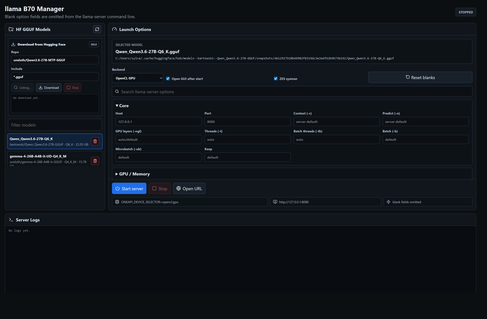

# llama B70 Manager

Local Windows manager for running one `llama-server.exe` instance from a llama.cpp SYCL build on Intel Arc GPUs.



The app provides:

- Hugging Face GGUF cache scanning
- Hugging Face model download by repo and include pattern
- repo file/quant listing before download
- one managed llama-server process at a time
- OpenCL GPU, Level Zero, and CPU fallback launch modes
- llama-server option controls with blank values omitted
- LAN API access by default with `--host 0.0.0.0`
- local GGUF deletion guarded to the Hugging Face cache

## Requirements

- Windows
- Node.js 20 or newer
- Intel oneAPI Base Toolkit
- Intel graphics driver with SYCL-visible GPU support
- a llama.cpp Windows SYCL build containing `llama-server.exe`
- Python Hugging Face CLI if using the downloader

## Configure

Defaults are aimed at a local Windows install. Override them with environment variables when needed:

| Variable | Default |
| --- | --- |
| `LLAMA_MANAGER_PORT` | `31337` |
| `LLAMA_CPP_DIR` | `%USERPROFILE%/apps/llama-b70-sycl` |
| `LLAMA_SERVER_EXE` | `%USERPROFILE%/apps/llama-b70-sycl/llama-server.exe` |
| `ONEAPI_SETVARS` | `C:/Program Files (x86)/Intel/oneAPI/setvars.bat` |
| `HUGGINGFACE_CLI` | `C:/Program Files/Python310/Scripts/huggingface-cli.exe` |
| `HF_HUB_CACHE` | `%USERPROFILE%/.cache/huggingface/hub` |

## Run

```cmd
npm install
npm run build
npm run server
```

Open:

```text
http://127.0.0.1:31337/
```

## Remote API Access

The manager starts `llama-server.exe` with host `0.0.0.0` by default, so other machines on the same LAN can call the llama.cpp OpenAI-compatible API:

```text
http://<this-pc-ip>:8080/v1
```

The manager shows the concrete inference API URL in the runtime strip after it detects the server. The local "Open URL" action still uses `127.0.0.1` because `0.0.0.0` is a bind address, not a useful browser destination. If another local server cannot connect, allow inbound TCP port `8080` through Windows Firewall for your private network.

For development:

```cmd
npm run dev
```

## Safety Notes

The delete action only removes local `.gguf` files under the configured Hugging Face cache. It refuses non-GGUF files and paths outside that cache.
